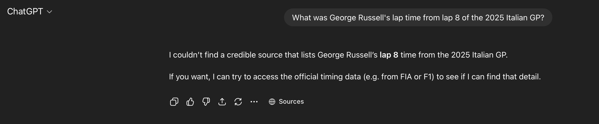
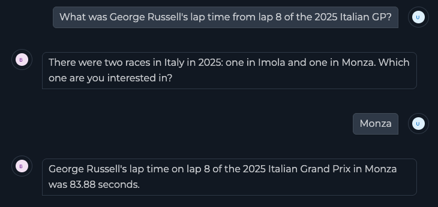

# F1 Chat Agent

An intelligent F1 data assistant that uses Google Gemini's and openF1 API to retrieve and analyze Formula 1 data.
Many LLM's fall short on live information as they are only trained to a certain point. This enables gemini to decide what API's to call to retreive data nd if it eed to call more API's or if it has enough data to make an informed response.

An example would be: Asking the chatbot what was a drivers lap time on a specific lap. This would require gemeini to request the data for the session info of that specific race, call an API to get the lap information for that race, and then call an API to get the driver information to map driver name ot number. Doing all of this while not storing or saving excessive amounts of data and just using an API that already exists. 

Check the Why This Matters section for an example of the usefulness.

## Try It Live

**[Click here to try the F1 Chat Agent live on Hugging Face Spaces](https://huggingface.co/spaces/QuinnBGC/f1-chat-agent)**

## Why This Matters

**ChatGPT's Limitation:**


**My F1 Agent's Solution:**


*See the difference? While ChatGPT can't access current F1 data, my agent retrieves real-time information directly from the OpenF1 API.*


## Features

- **Intelligent Query Processing**: Understands natural language queries about F1 data
- **Multi-step Data Retrieval**: Automatically chains API calls to get complete information
- **Real-time Data**: Fetches live F1 data from the OpenF1 API
- **Continuous Chat**: Maintains conversation context for follow-up questions

## Example Queries

- "What was George Russell's lap time on lap 8 of Bahrain?"
- "Show me all drivers in the latest race"
- "Who had the fastest lap in qualifying at Monaco?"

## How It Works

The agent uses Google Gemini's function calling feature to:

1. **Analyze your query** to understand what F1 data you need
2. **Call appropriate functions** from `crud/f1_getters.py`:
   - `get_sessions()` - Find race sessions by year, country, or type
   - `get_drivers()` - Get driver information for a specific session
   - `get_laps()` - Retrieve lap times and sector data
3. **Chain multiple calls** when needed (e.g., session → drivers → specific lap times)
4. **Provide detailed answers** based on the retrieved data

## Architecture

- `application/main.py` - Main chat agent with Gemini integration
- `crud/f1_getters.py` - F1 data retrieval functions
- `crud/f1_data_types.py` - Data models for F1 entities
- `app.py` - Hugging Face Spaces entry point
- `gradio_app.py` - Web interface with Gradio

## Example Conversation

```
User: What was George Russell's lap time on lap 8 of Bahrain?

Agent: I'll help you find George Russell's lap time on lap 8 of the Bahrain race.

[Function calls happen automatically in the background]

Agent: George Russell's lap time on lap 8 of the Bahrain race was 1:32.456. 
This was his 8th lap of the race, and he was driving for Mercedes (driver #63).
```

## Requirements

- Google Gemini API key (set as environment variable `GEMINI_API_KEY`)
- Internet connection for F1 data API calls